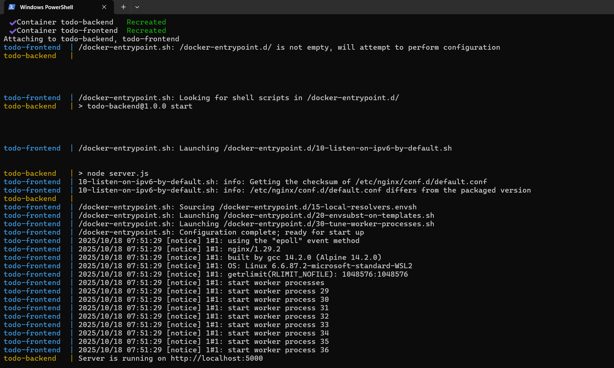

# 📝 Todo List Application



A modern, full-stack todo list application with a sleek black and white minimalist UI, built with React frontend and Node.js/Express backend, containerized with Docker for easy deployment and development.

## 🌟 Features

- ✨ **Create, Read, Update, and Delete** todos seamlessly
- ✅ **Mark todos as complete/incomplete** with a single click
- ✏️ **Inline editing** - double-click any todo to edit it instantly
- 🎨 **Modern minimalist UI** - elegant black and white theme
- 🚀 **Smooth animations** and transitions for enhanced user experience
- 🐳 **Docker-powered** - run everything with a single command
- 🔄 **Real-time updates** - instant feedback on all actions
- ⚡ **Fast and responsive** - optimized performance

## 🏗️ Architecture

This application follows a microservices architecture with:

- **Frontend**: React 18 with modern hooks and functional components
- **Backend**: Node.js with Express REST API
- **Containerization**: Docker and Docker Compose for orchestration
- **Networking**: Bridge network for service communication

## 📋 Prerequisites

Before you begin, ensure you have the following installed:

- [Node.js](https://nodejs.org/) (v14 or higher) and npm
- [Docker](https://www.docker.com/get-started) and Docker Compose (v3.8 or higher)
- Git (for cloning the repository)

## 🚀 Quick Start

### Option 1: Using Docker (Recommended)

This is the easiest way to get started. Docker handles all dependencies and configurations automatically.

#### Production Mode

```bash
# Build and start all services
docker-compose up -d

# View logs
docker-compose logs -f

# Stop services
docker-compose down
```

Once started, access the application at:
- **Frontend**: http://localhost
- **Backend API**: http://localhost:5000

#### Development Mode

For development with hot-reload and volume mounting:

```bash
# Start development environment
docker-compose -f docker-compose.dev.yml up

# In separate terminal, view logs
docker-compose -f docker-compose.dev.yml logs -f
```

Development URLs:
- **Frontend**: http://localhost:3000 (with hot-reload)
- **Backend API**: http://localhost:5000

### Option 2: Local Development (Without Docker)

If you prefer running locally without Docker:

#### 1. Install Dependencies

```bash
# Install all dependencies (backend and frontend)
npm run install-all
```

Or install separately:

```bash
# Install backend dependencies
npm run install-backend

# Install frontend dependencies
npm run install-frontend
```

#### 2. Start the Application

**Terminal 1 - Start Backend:**
```bash
npm run start-backend
```
The backend will run on `http://localhost:5000`

**Terminal 2 - Start Frontend:**
```bash
npm run start-frontend
```
The frontend will automatically open at `http://localhost:3000`

#### Development Mode (with auto-reload)

```bash
# Terminal 1 - Backend with nodemon
npm run dev-backend

# Terminal 2 - Frontend (already has hot-reload)
npm run start-frontend
```

## 📁 Project Structure

```
todo-list-powered-with-Docker/
├── backend/                 # Node.js/Express backend
│   ├── Dockerfile           # Production Docker image
│   ├── Dockerfile.dev       # Development Docker image
│   ├── server.js           # Express server and API routes
│   └── package.json        # Backend dependencies
├── frontend/                # React frontend
│   ├── Dockerfile           # Production Docker image
│   ├── Dockerfile.dev       # Development Docker image
│   ├── public/              # Static files
│   ├── src/
│   │   ├── components/      # React components
│   │   │   ├── TodoForm.js  # Todo input form
│   │   │   ├── TodoItem.js  # Individual todo item
│   │   │   └── TodoList.js  # Todo list container
│   │   ├── App.js          # Main App component
│   │   └── App.css         # Main styles
│   └── package.json        # Frontend dependencies
├── docker-compose.yml       # Production Docker Compose
├── docker-compose.dev.yml  # Development Docker Compose
└── package.json            # Root package.json with scripts
```

## 🔧 Configuration

### Environment Variables

**Backend:**
- `NODE_ENV`: Environment mode (production/development)
- `PORT`: Server port (default: 5000)

**Frontend:**
- `REACT_APP_API_URL`: Backend API URL (default: http://localhost:5000)
- `CHOKIDAR_USEPOLLING`: Enable file watching in Docker (development only)

### Port Configuration

- **Frontend (Production)**: Port 80
- **Frontend (Development)**: Port 3000
- **Backend**: Port 5000

## 📡 API Endpoints

The backend provides a RESTful API with the following endpoints:

| Method | Endpoint | Description |
|--------|----------|-------------|
| `GET` | `/api/todos` | Get all todos |
| `GET` | `/api/todos/:id` | Get a specific todo |
| `POST` | `/api/todos` | Create a new todo |
| `PUT` | `/api/todos/:id` | Update a todo |
| `DELETE` | `/api/todos/:id` | Delete a todo |
| `GET` | `/health` | Health check endpoint |

### Example API Usage

```bash
# Get all todos
curl http://localhost:5000/api/todos

# Create a new todo
curl -X POST http://localhost:5000/api/todos \
  -H "Content-Type: application/json" \
  -d '{"title": "New Todo Item"}'

# Update a todo
curl -X PUT http://localhost:5000/api/todos/1 \
  -H "Content-Type: application/json" \
  -d '{"completed": true}'

# Delete a todo
curl -X DELETE http://localhost:5000/api/todos/1
```

## 🛠️ Technologies Used

- **Frontend:**
  - React 18.2.0
  - Axios (HTTP client)
  - CSS3 (with animations)

- **Backend:**
  - Node.js
  - Express.js 4.18.2
  - CORS middleware
  - Body-parser

- **DevOps:**
  - Docker
  - Docker Compose
  - Nginx (for production frontend)

## 🎨 UI Features

- **Minimalist Design**: Clean black and white theme
- **Responsive Layout**: Works on desktop and mobile devices
- **Smooth Animations**: Fade-in and slide animations for better UX
- **Interactive Elements**: Hover effects and transitions
- **Error Handling**: User-friendly error messages with dismiss option
- **Loading States**: Visual feedback during data fetching
- **Empty States**: Helpful messages when no todos exist

## 🔍 Troubleshooting

### Docker Issues

```bash
# Check if containers are running
docker-compose ps

# Restart services
docker-compose restart

# Rebuild containers
docker-compose up -d --build

# View detailed logs
docker-compose logs backend
docker-compose logs frontend
```

### Port Already in Use

If you encounter port conflicts:

1. **Change ports in docker-compose.yml:**
   ```yaml
   ports:
     - "8080:80"  # Change frontend port
     - "5001:5000"  # Change backend port
   ```

2. **Or stop the conflicting service:**
   ```bash
   # Find process using port 5000
   lsof -i :5000  # macOS/Linux
   netstat -ano | findstr :5000  # Windows
   ```

### Frontend Can't Connect to Backend

- Ensure backend is running on port 5000
- Check CORS settings in backend
- Verify `REACT_APP_API_URL` environment variable
- Check browser console for errors

## 📝 Available Scripts

### Root Level

- `npm run install-all` - Install all dependencies
- `npm run install-backend` - Install backend dependencies
- `npm run install-frontend` - Install frontend dependencies
- `npm run start-backend` - Start backend server
- `npm run start-frontend` - Start frontend development server
- `npm run dev-backend` - Start backend with nodemon (auto-reload)

## 🚢 Production Deployment

### Using Docker Compose

```bash
# Build and start in production mode
docker-compose up -d

# Scale services if needed
docker-compose up -d --scale backend=2
```

### Build Frontend for Production

```bash
cd frontend
npm run build
```

The optimized production build will be in `frontend/build/`

## 🤝 Contributing

Contributions are welcome! Please feel free to submit a Pull Request.

1. Fork the repository
2. Create your feature branch (`git checkout -b feature/AmazingFeature`)
3. Commit your changes (`git commit -m 'Add some AmazingFeature'`)
4. Push to the branch (`git push origin feature/AmazingFeature`)
5. Open a Pull Request


---

**Note**: The backend uses in-memory storage for simplicity. Todos will reset when the server restarts. For production use, consider integrating a database like MongoDB, PostgreSQL, or MySQL.

